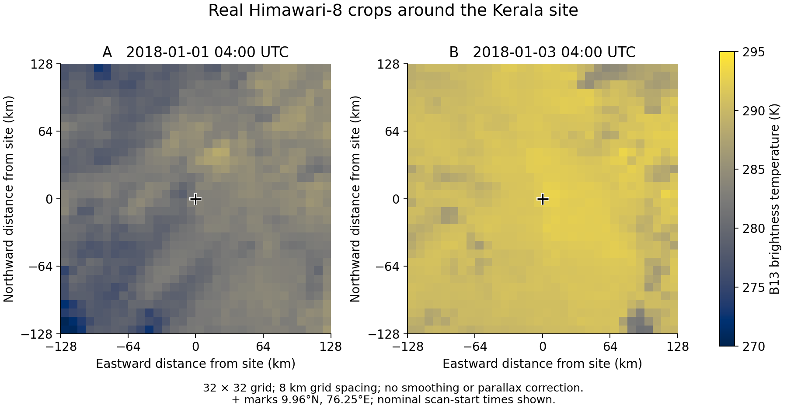

# First implementation results

**Status:** the standalone data pipeline, classical baselines, three neural model types and a real-image fusion smoke experiment run on CPU. The complete project is prepared for local Python and Colab. This is the first engineering delivery, not a completed multi-season fusion study.

## NSRDB audit and baseline

The supplied CSV contains 52,560 ten-minute rows for 2018. Its timestamps are UTC according to the source metadata; no duplicate/off-grid timestamps, unexpected cadence gaps or missing measurements were found. There are no supplied clear-sky GHI or fill-flag columns. The code therefore uses a documented Haurwitz normalization reference. Upstream filling/interpolation cannot be excluded from completeness alone.

After common daytime, finite-history and split-boundary filtering, the scientific configuration has 12,035 training, 5,202 validation and 3,204 reserved test windows. The extra 30-minute lookback used by pressure tendency is included in split purging. Training is January–July, validation August–October, and November–December has **not been evaluated**.

On the 5,202 eligible August–October validation issue times, at a 60-minute horizon:

| Model | Index MAE | GHI MAE (W/m²) |
|---|---:|---:|
| Raw GHI persistence | 0.250887 | 158.10 |
| Training calendar climatology | 0.156546 | 109.78 |
| Smart persistence | 0.123998 | 84.48 |
| Histogram gradient boosting | 0.108626 | 75.45 |

Boosting improves normalized MAE by **12.40%** relative to smart persistence. The paired seven-day calendar-block bootstrap (14 represented blocks, 5,000 resamples, seed13) gives a 95% relative-skill interval of **9.33–15.36%** and an index-MAE difference interval of **0.01108–0.01980**. This is an exploratory validation comparison, not a final held-out claim or evidence of added Himawari image value. Raw rows are not independent replicates.

Evidence: `outputs/nsrdb_baselines/metrics.json`, `predictions.csv`, `comparison_60m.json`, `run.json`; data audit in `outputs/kerala_2018_audit.json`.

## Real Himawari acquisition

The anonymous AWS archive was verified for 2018. The predeclared B13 example consists of 04:00–06:20 UTC on January1/3/5. Of 45 requested timestamps, 44 have the required file. January5 05:10 is missing and was not filled. All 44 downloaded files produced valid 32×32 Kelvin crops over a 256×256 km region around the site. Every local pixel passed the finite/physical-range check for this example.

The exact listed payload for one full acquisition is 1,074,348,509 bytes (1.000565 GiB). The initial environment reset removed its transient copy, so the example was reacquired and saved with the deliverable. One late transfer interruption was recovered using the crop cache. `data/patches/smoke/acquisition.json` describes the **last invocation only** (two new, 42 cached); the inventory and per-image metadata describe the full 44-frame dataset. See `docs/RESOURCE_PLAN.md` for the extra recovery traffic and full-year estimates.

Each crop JSON preserves the source key/hash, observed scan end, assumed availability time, Kelvin units, regional geometry and crop hash. Images are admitted no earlier than scan completion and a nominal 10-minute availability lag. The first nominal 04:00 frame, for example, completes around 04:09:40 and is available under this assumption at 04:10. Actual archive/operational delivery latency has not been measured.

The diagnostic uses a common Kelvin color scale and nearest-neighbor pixels without smoothing or enhancement. Coordinate axes are local distance from the site. PNG/SVG, source-array hashes and plotting code are included. The nominal 2 km sensor specification is not effective resolution at this approximately 73° viewing angle; no cloud-parallax correction was applied.

## Neural execution check — not research evidence

Image alignment produces 10 training windows on January1, 10 validation windows on January3, and four reserved engineering windows on January5. All classical and neural smoke models use those same eligible timestamps. The neural models run just three epochs at seed13 on CPU.

| Model | Parameters | Validation 60-minute index MAE |
|---|---:|---:|
| Smart persistence | — | 0.021784 |
| Gradient boosting | — | 0.020194 |
| Tabular TCN | 2,468 | 0.596422 |
| Image CNN–GRU | 7,956 | 0.869343 |
| Fusion | 10,340 | 0.987037 |

**Fusion does not outperform persistence in this smoke run.** The three-epoch fusion forecast at 60 minutes is still negative before flooring and therefore predicts zero after the physical nonnegativity rule. This is an undertrained model in a tiny exercise, not a useful forecast. Do not select an architecture, make statistical claims, or compare this table directly to the full NSRDB benchmark. There is only one represented validation block, so the comparison code correctly returns no confidence interval.

Training, gradients, image/tabular batching, checkpoint selection, prediction serialization and metric calculation are exercised on actual downloaded imagery. Longer training on a sufficiently diverse, predeclared cohort is required for the research question. The three-band/full-year model campaign and GPU execution have not been run in this environment.

## Validation and corrections

- **13 integrity tests pass**, covering UTC metadata, raw-history split purging, forward-information isolation, archive resolution/segment checks, scan availability, download budget enforcement, matched-cohort comparisons, derived-feature ablation, causal convolution, stable constant-feature normalization and dataset fingerprinting.
- A simulated interruption after epoch1 was resumed. Final model weights and all 40 validation prediction rows match the uninterrupted CPU run exactly; both `last.pt` and `best.pt` are included.
- All notebook code cells compile. The equivalent commands ran locally on CPU. The hosted Colab upload UI and GPU hardware have not been exercised here.
- Packaging installation is checked separately; see `outputs/package_install.log`. Full environment records are saved in `docs/tested_environment.json` and run directories.

Two implementation issues were found and fixed before this delivery: split purging initially omitted the extra pressure-tendency lookback, and float32 variance accumulation assigned a tiny false variance to a constant moisture feature. Neural normalization now computes training moments in float64 and gives constant features unit scale. The latter correction was prompted by numerical blow-up, not by selecting a preferred forecast score. A regression test covers it; interrupted checkpoints with incompatible normalization are rejected.

The initial erroneous neural metrics (fusion 60-minute index MAE about32.67) are recorded in `outputs/decision_log.json`; those checkpoints are not distributed as usable models. No architecture/epoch/seed search was performed to improve the smoke ranking. Model selection used validation only.

## Next research step

Run the bundled notebook first. Then inventory a seasonally distributed set of contiguous satellite blocks under a realistic transfer allowance, retaining a fixed held-out period. Rerun all local baselines on that exact image cohort and execute the three-seed core/ablation matrix. The documented 5% improvement threshold is a research target, not an established finding for fusion.

NSRDB irradiance/cloud labels already share Himawari provenance. Any fusion improvement would demonstrate added predictive representation/context for that product; independent ground irradiance is still required for claims about measured physical accuracy. Cloud-transition classification and operational event prediction with temporally overlapping VOCI data remain future extensions.
